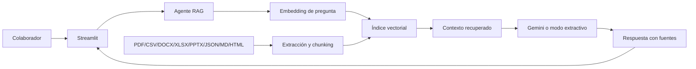

# Santos Pegasus Corporate AI

Agente corporativo de inteligencia artificial con arquitectura **RAG (Retrieval-Augmented Generation)** que responde preguntas con base en documentos internos ficticios y muestra las fuentes utilizadas.

> Proyecto educativo desarrollado para el Challenge Alura Agentes. Los nombres, correos y políticas incluidos son ficticios.

## Demostración

Después del despliegue en OCI, agrega aquí la captura real:

```markdown

```

**URL pública:** `http://TU_IP_PUBLICA:8501`

## Problema que resuelve

La documentación corporativa suele estar dispersa entre PDF, Word, Excel, PowerPoint, CSV, JSON, Markdown y HTML. El agente centraliza la consulta mediante lenguaje natural, recupera fragmentos relevantes y evita responder cuando no existe evidencia suficiente.

## Funcionalidades

- Lectura de PDF, CSV, JSON, Markdown, HTML, TXT, DOCX, XLSX y PPTX.
- Limpieza, chunking y metadatos por documento.
- Embeddings semánticos con SentenceTransformers.
- Fallback automático a TF-IDF cuando el modelo de embeddings no está disponible.
- Recuperación por similitud y filtro por categoría.
- Generación con Gemini cuando existe `GOOGLE_API_KEY`.
- Modo extractivo local para ejecutar el proyecto sin API.
- Respuestas con documento, ubicación y puntuación de relevancia.
- Fallback explícito cuando no existe información.
- Interfaz de chat en Streamlit.
- Pruebas automáticas con pytest.
- Contenedor Docker y guía de despliegue en OCI Compute.
- CI con GitHub Actions.

## Arquitectura



## Flujo RAG

1. Los documentos se descubren en `documents/`.
2. Cada formato se convierte en secciones de texto con metadatos.
3. El texto se limpia y divide en fragmentos con superposición.
4. Los fragmentos se convierten en embeddings y se guardan en `data/index/`.
5. La pregunta se vectoriza con el mismo modelo.
6. Se recuperan los fragmentos más similares.
7. Si la relevancia es suficiente, Gemini genera una respuesta fundamentada.
8. Sin clave de API, se produce una respuesta extractiva local.
9. Si no hay evidencia, el agente informa que no encontró la información.
10. La interfaz muestra las fuentes y ubicaciones utilizadas.

## Tecnologías

- Python 3.11
- Streamlit
- SentenceTransformers
- scikit-learn
- Google Gemini mediante `google-genai`
- PyPDF, pandas, python-docx, openpyxl, python-pptx
- Docker
- Oracle Cloud Infrastructure Compute
- GitHub Actions

## Documentos incluidos

| Archivo | Formato | Dominio |
|---|---:|---|
| Manual de Onboarding | PDF | Recursos Humanos |
| Guía Backend | PDF | Ingeniería |
| Guía Frontend | PDF | Ingeniería |
| Protocolo de Incidentes | PDF | Operaciones |
| Arquitectura de Microservicios | PDF | Sistemas |
| Directorio de colaboradores | CSV | Comunicación interna |
| Política de seguridad | Markdown | Compliance |
| FAQ de soporte | HTML | Soporte |
| Catálogo de servicios | JSON | Operaciones |
| Capacitación interna | DOCX | RH |
| Matriz de SLA | XLSX | Operaciones |
| Roadmap tecnológico | PPTX | Estrategia |

## Ejecución local

### 1. Clonar

```bash
git clone https://github.com/TU_USUARIO/santos-pegasus-ai-assistant.git
cd santos-pegasus-ai-assistant
```

### 2. Entorno virtual

Windows PowerShell:

```powershell
py -3.11 -m venv .venv
.\.venv\Scripts\Activate.ps1
```

Linux/macOS:

```bash
python3.11 -m venv .venv
source .venv/bin/activate
```

### 3. Instalar

```bash
python -m pip install --upgrade pip
pip install -r requirements.txt
```

### 4. Configurar

```bash
cp .env.example .env
```

En Windows:

```powershell
Copy-Item .env.example .env
```

La clave de Gemini es opcional:

```env
GOOGLE_API_KEY=tu_clave
```

### 5. Construir índice

```bash
python scripts/build_index.py
```

### 6. Ejecutar

```bash
streamlit run app.py
```

Abre `http://localhost:8501`.

## Docker

```bash
cp .env.example .env
docker build -t santos-pegasus-ai-assistant .
docker run --rm -p 8501:8501 --env-file .env santos-pegasus-ai-assistant
```

O:

```bash
docker compose up --build
```

## Pruebas

```bash
pytest -q
python scripts/run_smoke_demo.py
```

## Despliegue en OCI

Consulta la guía completa:

[`infra/oci/DEPLOY_OCI.md`](infra/oci/DEPLOY_OCI.md)

Resumen:

1. Crear una instancia OCI Compute.
2. Abrir TCP 8501 en la VCN y firewall.
3. Instalar Docker.
4. Clonar el repositorio.
5. Construir y ejecutar el contenedor.
6. Abrir `http://IP_PUBLICA:8501`.
7. Tomar capturas reales y agregarlas al README.

## Preguntas de demostración

- ¿Qué herramientas debe instalar un nuevo desarrollador?
- ¿Qué versión de Java utiliza el equipo backend?
- ¿Qué debe contener un post-mortem?
- ¿Qué microservicio administra las órdenes?
- ¿Quién aprueba los permisos de OCI?
- ¿Cuál es el tiempo de primera comunicación de un SEV-1?
- ¿Cómo se solicita un acceso?
- ¿Cuál es el SLA para dar de alta un repositorio?

Pregunta sin respuesta esperada:

- ¿Cuánto gana un desarrollador?

Respuesta esperada: el agente debe indicar que no encontró la información.

## Estructura

```text
.
├── app.py
├── documents/
├── src/
│   ├── config.py
│   ├── document_loader.py
│   ├── indexing.py
│   ├── models.py
│   ├── rag_agent.py
│   ├── text_processor.py
│   └── vector_store.py
├── scripts/
├── tests/
├── infra/oci/
├── assets/
├── Dockerfile
├── docker-compose.yml
└── requirements.txt
```

## Publicación en GitHub

Crea un repositorio público vacío y ejecuta:

```bash
git init
git add .
git commit -m "feat: agente corporativo RAG funcional"
git branch -M main
git remote add origin https://github.com/TU_USUARIO/santos-pegasus-ai-assistant.git
git push -u origin main
```

Commits posteriores sugeridos:

```bash
git add .
git commit -m "docs: agregar evidencia del despliegue en OCI"
git push
```

## Checklist de entrega Alura

- [x] Código fuente organizado.
- [x] Agente funcional con PDF y CSV.
- [x] Procesamiento e indexación documental.
- [x] README con arquitectura, tecnologías e instrucciones.
- [x] Dockerfile.
- [x] Guía de despliegue en OCI.
- [ ] Aplicación desplegada en OCI.
- [ ] URL pública agregada.
- [ ] Captura real del agente ejecutándose en OCI.
- [ ] Repositorio público en GitHub.
- [ ] Historial de commits visible.
- [ ] Enlace enviado en Alura y badge descargado.

## Limitaciones

- Los documentos son ficticios.
- El modo local extractivo no redacta con la misma naturalidad que un LLM.
- La primera descarga del modelo de embeddings puede consumir tiempo y memoria.
- La seguridad empresarial real requeriría autenticación, autorización y controles de datos.

## Mejoras futuras

- OCI Object Storage para documentos.
- Oracle Database 23ai como almacén vectorial.
- OCI Vault para secretos.
- Pipeline de reindexación automática.
- Reranking.
- Evaluaciones RAG y dashboard de calidad.
- Integración con Slack o Microsoft Teams.

## Autor

**Francisco Israel Mecillas Hernández**

## Licencia

MIT.
