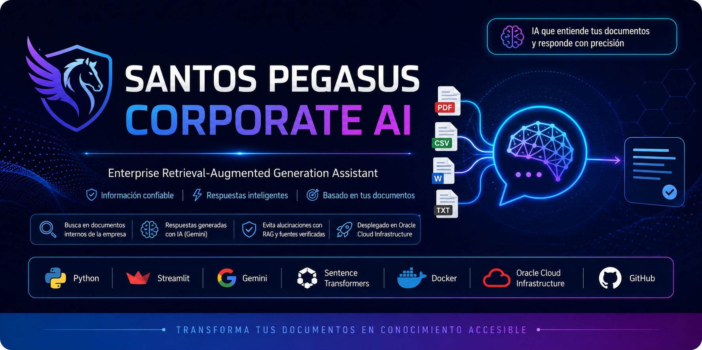
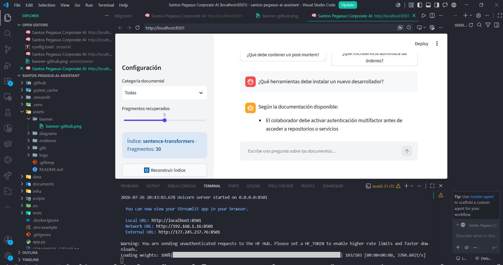

# 🤖 Santos Pegasus Corporate AI Assistant


Asistente corporativo inteligente basado en **Retrieval-Augmented Generation (RAG)** que permite consultar documentos internos mediante lenguaje natural.

---

# 📌 Descripción

Este proyecto implementa un asistente de IA capaz de responder preguntas utilizando la información contenida en documentos corporativos.

Los documentos son procesados, divididos en fragmentos, convertidos en vectores mediante embeddings y recuperados semánticamente para generar respuestas precisas.

---

# ✨ Características

- 📄 Lectura de documentos PDF, DOCX y TXT.
- 🔍 Búsqueda semántica mediante embeddings.
- 🤖 Respuestas generadas con IA.
- 📚 Recuperación de información (RAG).
- 🌐 Interfaz web con Streamlit.
- 🐳 Compatible con Docker.

---

# 🏗 Arquitectura

```text
Documentos
      │
      ▼
Carga de archivos
      │
      ▼
Chunking
      │
      ▼
Embeddings
      │
      ▼
Vector Store
      │
      ▼
Consulta del usuario
      │
      ▼
Búsqueda semántica
      │
      ▼
LLM
      │
      ▼
Respuesta
```

---

# 🛠 Tecnologías

- Python
- Streamlit
- Sentence Transformers
- FAISS
- LangChain 
---

# 📂 Estructura del Proyecto

```text
.
├── app.py
├── requirements.txt
├── scripts/
├── src/
└── README.md
```

---

# 🚀 Instalación

Clonar el repositorio:

```bash
git clone https://github.com/TU_USUARIO/santos-pegasus-ai-assistant.git

cd santos-pegasus-ai-assistant
```

Crear entorno virtual:

```bash
python -m venv .venv
```

Windows

```bash
.venv\Scripts\activate
```

Linux / macOS

```bash
source .venv/bin/activate
```

Instalar dependencias

```bash
pip install -r requirements.txt
```

---

# 📚 Construir el índice

```bash
python scripts/build_index.py
```

---

# ▶ Ejecutar la aplicación

```bash
python -m streamlit run app.py
```

Abrir en el navegador:

```
http://localhost:8501
```

---

# 📷 Evidencias

## Pantalla principal



## Consulta al asistente


 
---

# 💬 Ejemplo

**Pregunta**

> ¿Qué herramientas necesita un nuevo desarrollador?

**Respuesta**

> El asistente recupera la información del Manual de Onboarding y genera una respuesta utilizando únicamente el contenido encontrado en los documentos.

---

# 🎯 Objetivos

- Facilitar la consulta de documentación interna.
- Reducir tiempos de búsqueda.
- Mejorar la productividad.
- Implementar una solución RAG moderna.

---

# 📈 Mejoras Futuras

- Autenticación de usuarios.
- Base de datos vectorial en la nube.
- Historial de conversaciones.
- Carga de documentos desde SharePoint o Google Drive.
- Despliegue en Oracle Cloud.

---

# 👨‍💻 Autor

**Israel Mesillas**

Proyecto desarrollado como parte del **Alura Challenge - Agentes de IA**.

---

# 📄 Licencia

Este proyecto se distribuye bajo la licencia **MIT**.

---

⭐ Si este proyecto te resulta útil, considera darle una estrella en GitHub.
